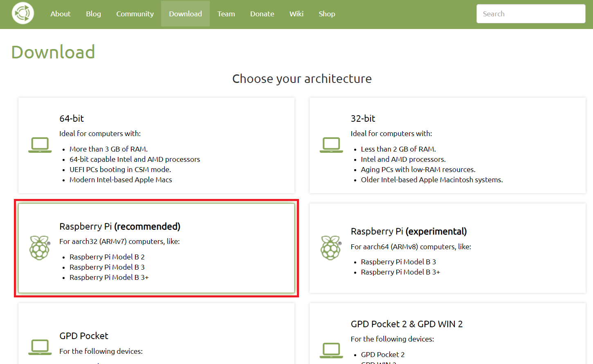
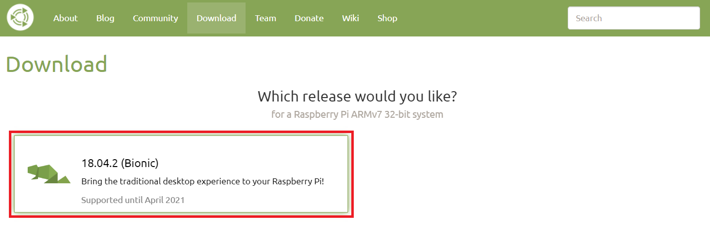
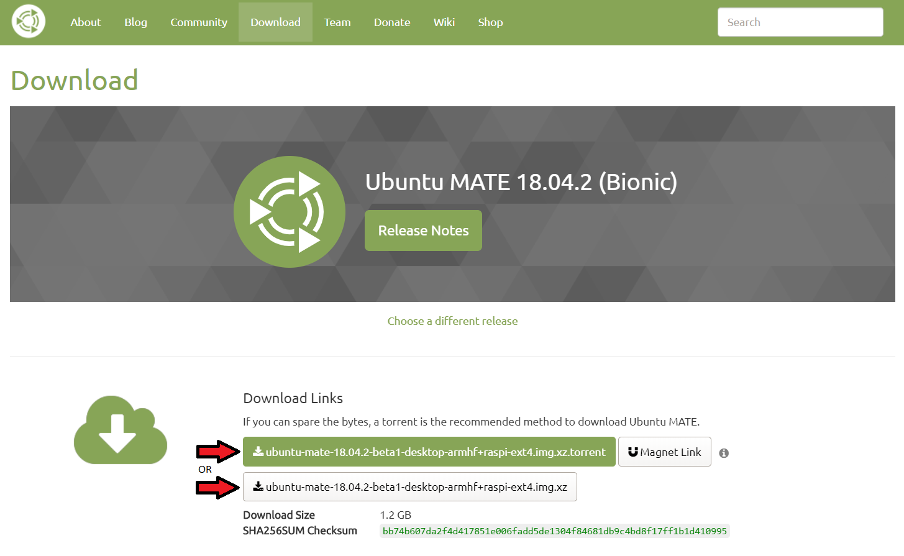
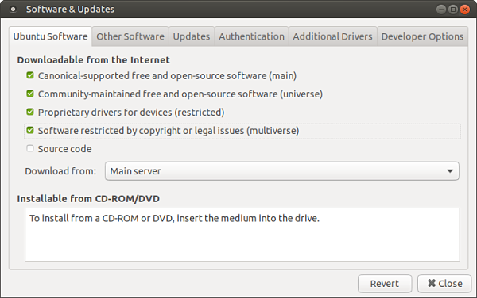
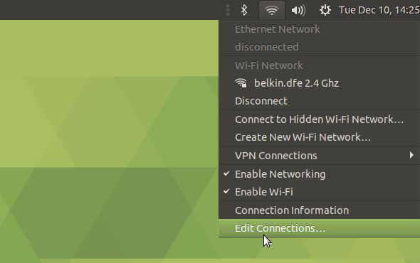
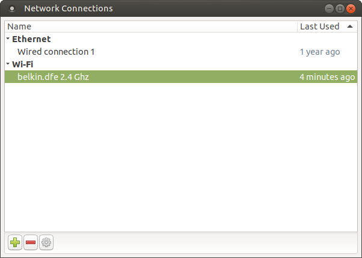
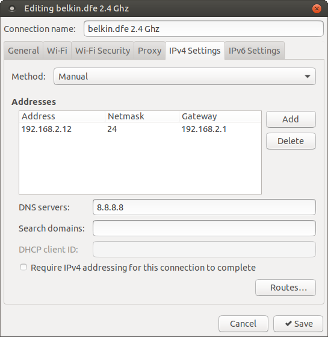

# Raspberry Pi 3B+ Configuration guide

Here is a guide to follow. If executed properly, this guide will setup your Raspberry Pi 3B+ to
work with this project.

## Overview

1) [Step 1 : Boot Ubuntu MATE](#step-1--boot-ubuntu-mate)
    - [Downloading Ubuntu MATE](#downloading-ubuntu-mate)
    - [Flashing Ubuntu MATE on the SD card](#flashing-ubuntu-mate-on-the-sd-card)
    - [Booting for the first time](#booting-for-the-first-time)
2) [Step 2 : Install ROS Melodic](#step-2--install-and-setup-ros-melodic)
    - [Setting up the downloadable content](#setting-up-the-downloadable-content)
    - [Installing ROS Melodic](#installing-ros-melodic)
    - [Setting up ROS Melodic to work on multiple machines](#setting-up-ros-melodic-to-work-on-multiple-machines)
3) [Step 3 : Switch Python version to Python 3.6](#step-3--switch-python-version-to-python-36)
4) [Step 4 : Setup SpheroJameoba](#step-4--setup-spherojameoba)
    - [Downloading SpheroJameoba](#downloading-spherojameoba)
    - [Installing required Python modules](#installing-required-python-modules)
5) [Step 5 : Setup a Static IP address](#step-5--setup-a-static-ip-address)
6) [Step 6 : Configure and use SSH](#step-6--configure-ssh)

## Step 1 : Boot Ubuntu MATE

### Downloading Ubuntu MATE

- Download Ubuntu MATE [here](https://ubuntu-mate.org/download/). Choose the recommended version.



- Choose the latest version (Bionic here).



- If you have a Torrent client setup, you can use the Torrent link, but either download method is fine.



- When the compressed image file is downloaded, make sure it is somewhere on your computer where you can easily
find it.

### Flashing Ubuntu MATE on the SD card

You can flash the Ubuntu MATE image on Windows and Ubuntu using [BalenaEtcher](https://www.balena.io/etcher/).
A useful tutorial can be found [here](https://www.ev3dev.org/docs/getting-started/#step-2-flash-the-sd-card).

### Booting for the first time

- Insert the SD card in the Raspberry Pi. Make sure the Raspberry Pi is not plugged in when doing so.

- Connect HDMI cable, mouse, keyboard and power to the Raspberry Pi.

- On the first boot, you'll be prompted with a setup wizard. Follow it carefully with these information in mind :

    - You need the Wifi to connect to `belkin.dfe 2.4 Ghz`. The password is : `12345677`

    - When asked for the the Name, Computer Name, Username and Password, use this naming convention :
        
        | Question      | Answer       | Comment                                   |
        |:--------------|:-------------|:------------------------------------------|
        | Name          | spenko       | ---                                       |
        | Computer name | robotics-piN | If it the 4th Raspberry Pi, N should be 4 |
        | Username      | spenko       | ---                                       |
        | Password      | robotics_lab | ---                                       |

## Step 2 : Install and setup ROS Melodic

### Setting up the downloadable content

- Go to `System -> Administration -> Software & Updates`.

- Check the following boxes.



### Installing ROS Melodic

To install ROS on Ubuntu MATE, run these command lines :

```shell script
$ sudo sh -c 'echo "deb http://packages.ros.org/ros/ubuntu $(lsb_release -sc) main" > /etc/apt/sources.list.d/ros-latest.list'
$ wget http://packages.ros.org/ros.key -O – | sudo apt-key add –
$ sudo apt update
$ sudo apt install ros-melodic-desktop-full
$ sudo rosdep init
$ rosdep update
$ echo "source /opt/ros/melodic/setup.bash" >> ~/.bashrc
$ source ~/.bashrc
$ sudo apt install python-rosinstall python-rosinstall-generator python-wstool build-essential
```
Sources :
- [Installing ROS Melodic on Raspberry Pi 3B running Ubuntu MATE 18.04.2 Bionic](https://www.intorobotics.com/installing-ros-melodic-on-raspberry-pi-3b-running-ubuntu-mate-18-04-2-bionic/)
- [How to install ROS Kinetic on Raspberry Pi 3 Ubuntu MATE](https://www.intorobotics.com/how-to-install-ros-kinetic-on-raspberry-pi-3-ubuntu-mate/)

### Setting up ROS Melodic to work on multiple machines

Finally, run these two lines to tell your Raspberry Pi where to look for the ROS Master Node :

```shell script
$ echo "export ROS_MASTER_URI=http://192.168.2.7:11311/" >> ~/.bashrc
$ source ~/.bashrc
```

## Step 3 : Switch Python version to Python 3.6

To switch to version 3.6 of Python, use these lines of code : 

```shell script
$ sudo update-alternatives --install /usr/bin/python python /usr/bin/python2.7 1
$ sudo update-alternatives --install /usr/bin/python python /usr/bin/python3.6 1
$ sudo update-alternatives --config python
```

After running the last line, you'll be ask to choose the version. Choose version 3.6.

To verify if it worked, run the following lin in a terminal :

```shell script
$ python -V
```

It should display :

```shell script
Python 3.6.X
```

[Source](https://linuxconfig.org/how-to-change-from-default-to-alternative-python-version-on-debian-linux)

## Step 4 : Setup SpheroJameoba

### Downloading SpheroJameoba

To download the SpheroJameoba package, run the following line in a terminal :

```shell script
$ mkdir Jameoba
$ cd Jameoba/
$ git clone https://github.com/BrunoB81HK/SpheroJameoba.git
$ cd SpheroJameoba/
$ git submodule init
$ git submodule update
$ cd apriltags3py/
$ git submodule init
$ git submodule update
$ cd ../
```

### Installing required Python modules

To install the required Python modules, run the following line in a terminal :

```shell script
$ pip3 install -r requirements.txt
```

*** ATTENTION : If pip3 is not installed on your computer, run this line to install it :
```shell script
$ sudo apt install python3-pip
```

## Step 5 : Setup a Static IP address

To setup a Static IP address, go to `Network -> Edit Connections -> [select belkin dfe 2.4 Ghz and press the setting 
button at the bottom left] -> IPv4 Settings` 






 
Set the following settings : 

| Setting     | Value         | Comment                                             |
|:------------|:--------------|:----------------------------------------------------|
| Method      | Manual        |                                                     |
| IP Address  | 192.168.2.X   | See README.md to deduct the next IP address to use. |
| Netmask     | 255.255.255.0 |                                                     |
| Gateway     | 192.168.2.1   |                                                     |
| DNS server  | 8.8.8.8       |                                                     |

Then, press `Save`, disconnect the Wifi and reconnect it.

You can use the following command line to know your current IP address and see if this worked : 
```shell script
$ ifconfig
```

## Step 6 : Configure SSH

To setup ssh you need to :

- Start SSH :

```shell script
$ sudo systemctl start ssh
```

- Generate the keys : 

```shell script
$ sudo /usr/bin/ssh-keygen -A
```

- Restart SSH

```shell script
$ sudo systemctl restart ssh
```
